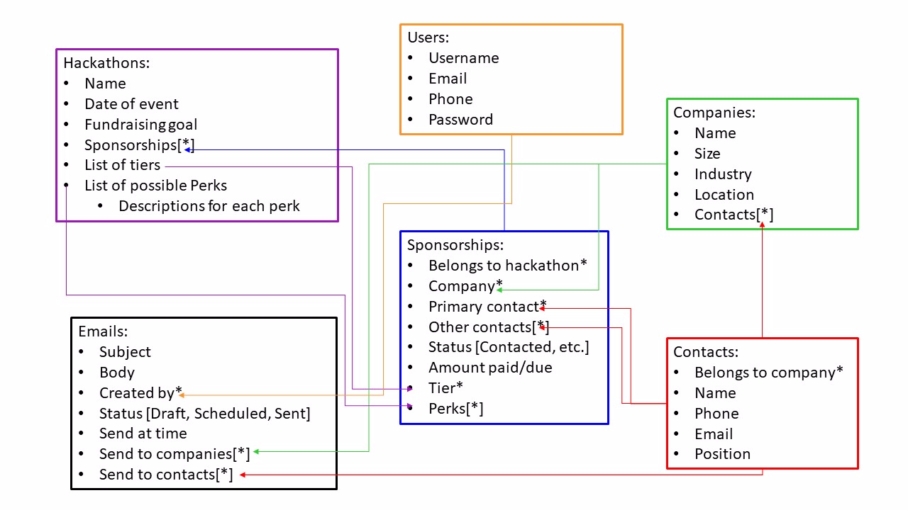

# [HackerForce](https://hacker-force.herokuapp.com/)

## Team Queue - Fall 2018

**Cory Lanza, Ishan Khatri, Kevin Fredericks, Nicholas Williams**

## Overview

`HackerForce` is a tool created to help hackathon organizers manage their sponsorship leads and keep track of contacts, emails and more. Every year hackathon organizers need to contact hundreds of contacts who work at hundreds of companies to request sponsorship. The process for this usually involves various rounds of customized emails to various groupings of companies. This tool aims to create a user friendly interface to see the status of various companies, store the details of certain contacts and overall manage the information required for hackathon sponsorship.

Many aspects of the application are similar to the CRM tool known as SalesForce and the project idea can be simply summed up as a subset of SalesForce features that is open-source and extensible for use by hackathon organizers or anyone else who desires an open-source, free CRM tool.

## User Interface

### Base Templates

**menu.html.j2**

Navigation bar for moving around the site, available on all pages. Also shows the current logged in user.

**footer.html.j2**

Footer available on all pages. Contains miscellaneous links.

**404.html.j2**

404 page for urls that aren't mapped.

### Dashboard

**dashboard.html.j2**

Home page that contains stats for your current hackathon (funding, sponsorships, company information) and links for hackathons and sponsorships.

### Login/Signup

**login.html.j2**

Basic login page.

**register.html.j2**

Basic registration page.

**After Registration**

After registering you're redirected back to the login page with the below popup.

**activation.html.j2**

This email is sent to you after you register so that you can confirm your registration.

**After Activation**

After clicking the link in the email you're redirected to the login page with the below popup.

### Profiles

**profile_edit.html.j2**

Page for editing your profile information.

**settings.html.j2**

Old static page that we didn't have time to revamp, but is still reachable. This would normally hold account settings like email preferences.

### Hackathons

**hackathons.html.j2**

Hackathon show page that lists all hackathons. Contains links to create new hackathons, tiers and perks. Also has links to each edit page and clicking on a tier or perk links to the respective edit page.

**hackathon_new.html.j2**

Form for creating a new hackathon.

**hackathon_edit.html.j2**

Form for editing an existing hackathon.

**sponsorships.html.j2**

Sponsorship show page containing links to edit each sponsorship (rightmost icon in the table).

**sponsorship_new.html.j2**

Form for creating a new sponsorship.

**sponsorship_edit.html.j2**

Form for editing an existing sponsorship.

**tier_new.html.j2**

Form for creating a new tier.

**tier_edit.html.j2**

For for editing an existing tier.

**perk_new.html.j2**

Form for creating a new perk.

**perk_edit.html.j2**

Form for editing an existing perk.

### Companies

**companies.html.j2**

Company show page that contains links to respective edit pages, and a link to create a new company.

**company_new.html.j2**

Form for creating a new company.

**company_edit.html.j2**

Form for editing an existing company.

### Contacts

**contacts.html.j2**

Contact show page that contains links to each respective edit page (scroll to the right in the table) and a link for creating new contacts.

**contact_new.html.j2**

Form for creating new contacts.

**contact_edit.html.j2**

Form for editing existing contacts.

### Emails

**emails.html.j2**

Page for creating and scheduling a new email.

**drafts.html.j2**

Show page for email drafts (unscheduled).

**outbox.html.j2**

Show page for scheduled but unsent emails.

**sent.html.j2**

Show page for emails that have already been sent.

**emails_edit.html.j2**

Edit page for scheduled but unsent emails.

**sent_view.html.j2**

Show page for emails that have already been sent.

## Data Model

<<<<<<< HEAD

=======

### Profiles

**User**

Extended from base django user model. Has many-one relationship with hackathons, so that the user can choose which hackathon is displayed on their dashboard. Has a many-one relationship with emails.

### Hackathons

**Hackathon**

Hackathons have a date and a fundraising goal. They have a one-many relationship with perks, sponsorships and tiers.

**Tier**

Sponsorship tiers belong to hackathons and have a many-many relationship with sponsorships.

**Perks**

Sponsorship perks belong to hackathons and have a many-many relationship with sponsorships.

**Sponsorship**

Company sponsorships which hold the amount of money a company has donated to a hackathon. Has a many-one relationship with companies and hackathons. Has a many-many relationship with perks and tiers.

### Companies

**Company**

Holds information on companies that have or might donate to a hackathon. Has a many-many relationship with industries. Has a one-many relationship with sponsorships and contacts. Has a many-many relationship with emails.

**Industry**

Holds types of industries so we can catagorize companies. Also has a colors field so that we can create css spans specific to the css library we're using.

### Contacts

**Contact**

Holds information on contacts for a given company. Has a many-one relationship with companies.

### Emails

**Email**

Stores all relevant information needed to send an email like subject, body, which companies it should be sent to and when it's scheduled to be sent. Has a many-one relationship with companies and users.

>>>>>>> docs(final): finish final submission writeup

## URL Routes

### Dashboard

**/** -> *dashboard.html.j2*

Routes to the dashboard page. It loads the hackathon it displayed based on the logged in user and their profile settings. Additionally the menu bar displays the current user's name with a dropdown only accessable if one is logged in, otherwise it shows a login button.

**404/** -> *404.html.j2*

404 for pages/routes that don't exist.

### Login/Signup

**login/** -> *login.html.j2*

Routes to the login page. Available to unauthenticated users. Additionally unauthenticated users are redirected to this page if they try access any page other than login/register/404.

**register/** -> *register.html.j2*

Routes to the registration page. Available to unauthenticated users. Additionally this view sends an authorization email to the user upon post.

**logout/** -> *login.html.j2*

Logs out current user and directs to login page.

### Profiles

**settings/** -> *settings.html.j2*

Routes to statis settings page.

**settings/edit** -> *profile_edit.html.j2*

Routes to profile edit page. Content depends on logged in user and is pulled from the user model.

### Hackathons

**hackathons/** -> *hackathons.html.j2*

Route to hackathons show page.

**hackathons/new** -> *hackathon_new.html.j2*

Route to hackathon creation page.

**hackathons/\<id\>/edit** -> *hackathon_edit.html.j2*

Route to hackathon edit page.

**hackathons/\<id\>sponsorships** -> *sponsorships.html.j2*

Route to sponsorships show page, for a given hackathon.

**hackathons/sponsorships/new** -> *sponsorship_new.html.j2*

Route to sponsorship creation page.

**hackathons/sponsorships/\<id\>/edit** -> *sponsorship_edit.html.j2*

Route to sponsorship edit page.

**hackathons/tiers/new** -> *tier_new.html.j2*

Route to tier creation page.

**hackathons/tiers/\<id\>/edit** -> *tier_edit.html.j2*

Route to tier edit page.

**hackathons/perks/new** -> *perk_new.html.j2*

Route to perk creation page.

**hackathons/perks/\<id\>/edit** -> *perk_edit.html.j2*

Route to perk edit page.

### Companies

**companies/** -> *companies.html.j2*

Route to companies show page.

**companies/new** -> *company_new.html.j2*

Route to company creation page.

**companies/\<id\>/edit** -> *company_edit.html.j2*

Route to company edit page.

### Contacts

**contacts/** -> *contacts.html.j2*

Route to contacts show page.

**contacts/new** -> *contact_new.html.j2*

Route to contact creation page.

**contacts/\<id\>/edit** -> *contact_edit.html.j2*

Route to contact edit page.

### Emails

**emails/** -> *emails.html.j2*

Route to email creation/scheduling page. When an email is created the person who created it is set to the current user.

**emails/drafts** -> *drafts.html.j2*

Route to email drafts show page.

**emails/outbox** -> *outbox.html.j2*

Route to email outbox show page.

**emails/sent** -> *sent.html.j2*

Route to sent emails show page.

**emails/\<id\>/edit** -> *emails_edit.html.j2*

Route to email editing page.

**emails/\<id\>/sent_view** -> *sent_view.html.j2*

Route to already sent email show page.

## Authentication

Users are authenticated using the django auth api. A user has to be logged in to access any pages other than the login/registration page. We also load a profile settings pages based on the current user. The admin pages are only available to superusers.

## Team Choice

<<<<<<< HEAD
For a team choice element, we implemented email verification as an additional step to authenticate new users. When a new user completes the sign up form, an email will be sent to the email address given prompting the user to click on a link. Their account will not be fully verified until they do so.
=======
For our team choice we added functionality to fully deploy to the application to heroku. You can find it hosted [here](https://hacker-force.herokuapp.com/)We also completed email functionality allowing us to send emails through the application itself. Specifically we added registration email verification, which involved configuring the django app to use a service called sendgrid for emailing using a heroku extension, and then adding the email as a template and sending it via the view.
>>>>>>> docs(final): finish final submission writeup

## Conclusion

We had an overall successful experience during the run of this course building our webapp, despite some setbacks. We were down a team member from the beginning, but because we all had experience with either web development or software engineering we managed to stay ahead of the curve for most of the required steps. We initially layed the groundwork to host the website on heroku during the first submission, so we already had a fully routed working django app by the time we started to make the actual mockup html pages. We also relied heavily on the css library tabler to make our website look good with minimal effort on our end (aside from a few problems related to importing the library in the first place). We built out the forms pages at the same times as we were making the models, and linked those together using the handy django forms api, along with using base form templates to save on time bulding individual html pages. During the final stretch we were able to implement an email service and we fixed up all the bugs we had been having. Early on we decided to switch templating engines from the base django one to jinja2, which turned out to be a mistake as we barely used the extra tools that it afforded us and it overcomplicated importing python functions into the templates. Making a custom user model also turned out to be somewhat tricky as we misunderstood how the auth api worked initially. We also had problems with importing our css library, as we first tried using a django library that included it that turned out to be an incomplete implementation and was msotly not working. We added the css library to our assets, but then had to fix some of the files, for example we didn't have jquery working until the last two weeks of the project because we had to go in and fix some of the js files in the library to properly work with django routes. We learned a lot this semester because we made sure that everyone on the team got to be involved making all the different parts of the django app, so while we may not be experts, we have a solid grasp on how to build our own websites in the future.W e weren't able to make it through every feature we wanted, but we're hoping to continue working on the project after this semester and make it a fully featured site.
