#HackerForce

##Team Queue - Fall 2018

**Cory Lanza, Ishan Khatri, Kevin Fredericks, Nicholas Williams**

##Overview

##User Interface

### Base Templates

**menu.html.j2**

Navigation bar for moving around the site, available on all pages. Also shows the current logged in user.

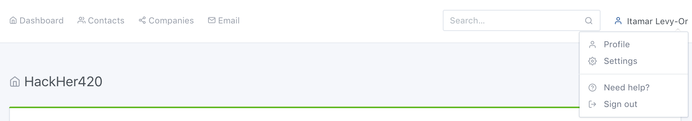

**footer.html.j2**

Footer available on all pages. Contains miscellaneous links.

**404.html.j2**

404 page for urls that aren't mapped.

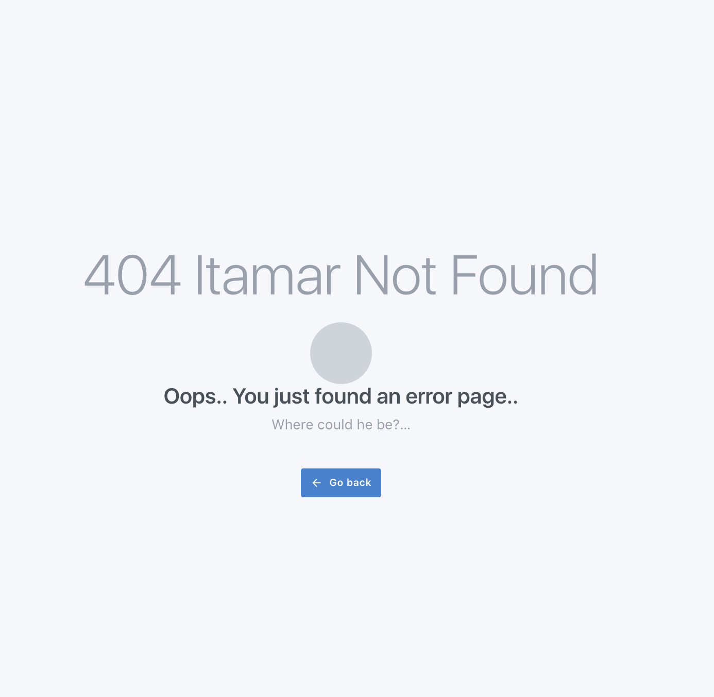

### Dashboard

**dashboard.html.j2**

Home page that contains stats for your current hackathon (funding, sponsorships, company information) and links for hackathons and sponsorships.

### Login/Signup

**login.html.j2**

Basic login page.

**register.html.j2**

Basic registration page.

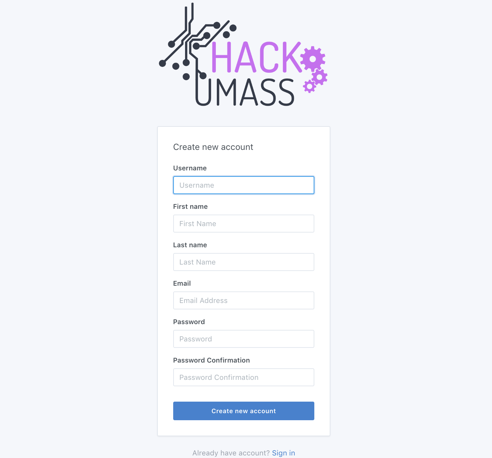

**After Registration**

After registering you're redirected back to the login page with the below popup.

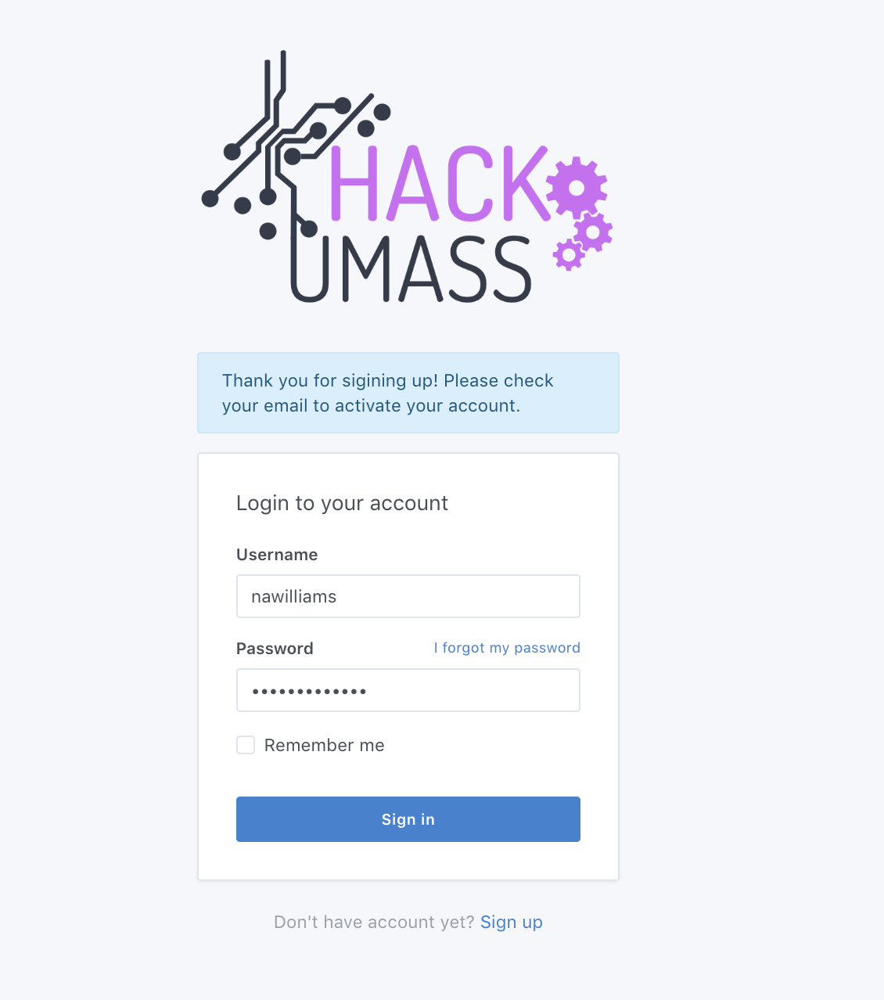

**activation.html.j2**

This email is sent to you after you register so that you can confirm your registration.

**After Activation**

After clicking the link in the email you're redirected to the login page with the below popup.

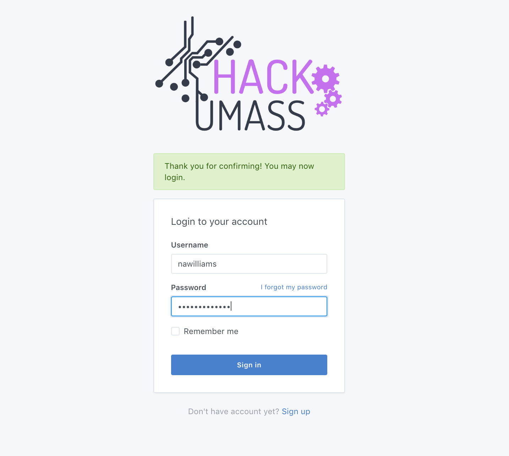

###Profiles

**profile_edit.html.j2**

Page for editing your profile information.

**settings.html.j2**

Old static page that we didn't have time to revamp, but is still reachable. This would normally hold account settings like email preferences.

### Hackathons

**hackathons.html.j2**

Hackathon show page that lists all hackathons. Contains links to create new hackathons, tiers and perks. Also has links to each edit page and clicking on a tier or perk links to the respective edit page.

**hackathon_new.html.j2**

Form for creating a new hackathon.

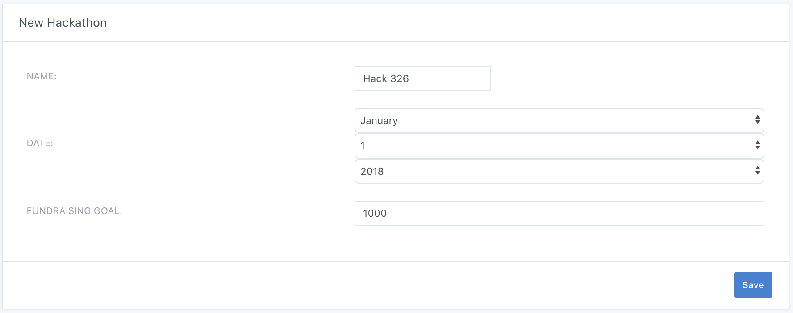

**hackathon_edit.html.j2**

Form for editing an existing hackathon.

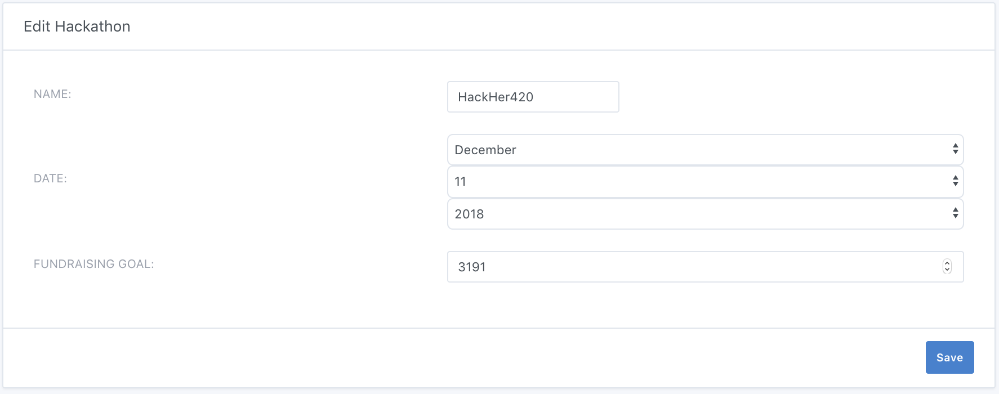

**sponsorships.html.j2**

Sponsorship show page containing links to edit each sponsorship (rightmost icon in the table).

**sponsorship_new.html.j2**

Form for creating a new sponsorship.

**sponsorship_edit.html.j2**

Form for editing an existing sponsorship.

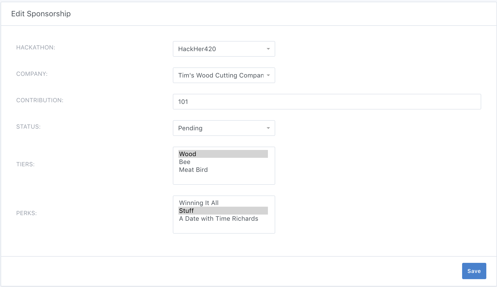

**tier_new.html.j2**

Form for creating a new tier.

**tier_edit.html.j2**

For for editing an existing tier.

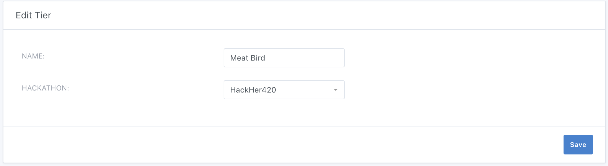

**perk_new.html.j2**

Form for creating a new perk.

**perk_edit.html.j2**

Form for editing an existing perk.

### Companies

**companies.html.j2**

Company show page that contains links to respective edit pages, and a link to create a new company.

**company_new.html.j2**

Form for creating a new company.

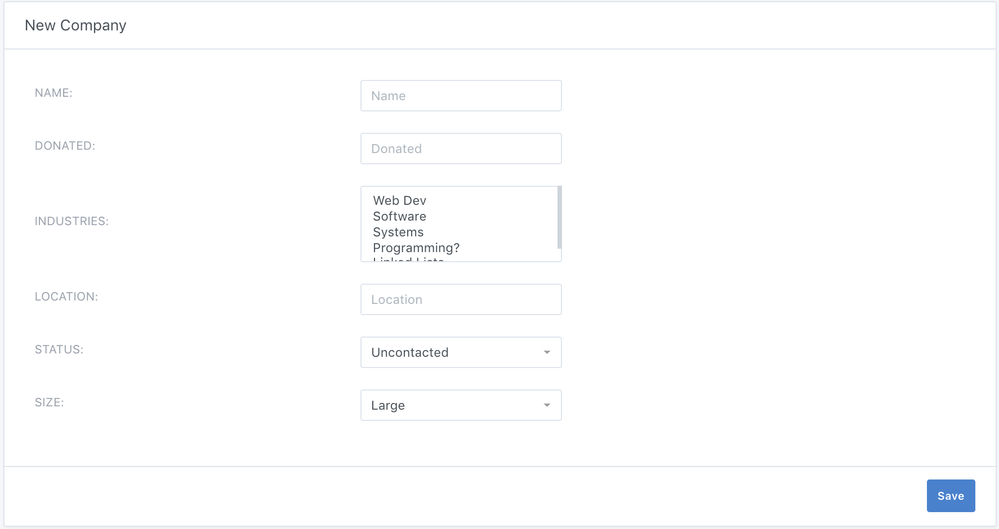

**company_edit.html.j2**

Form for editing an existing company.

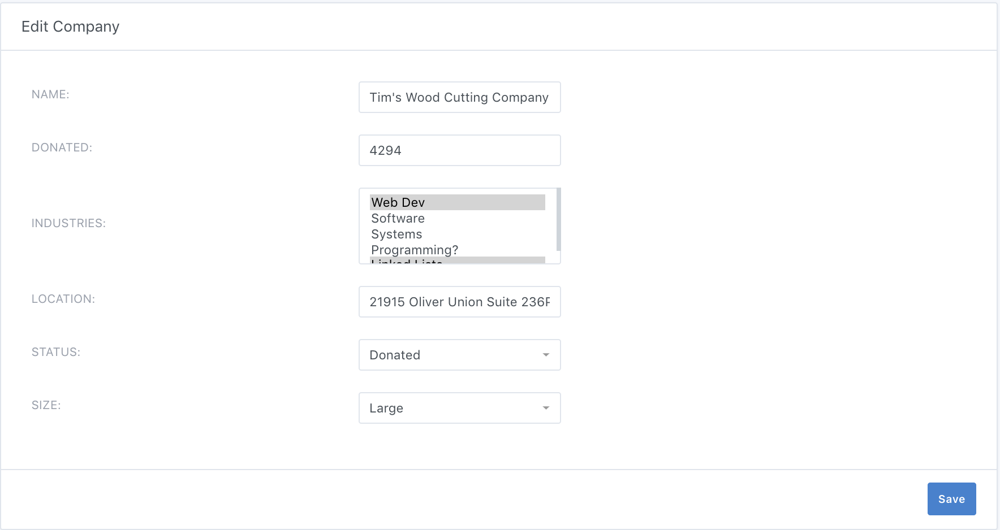

### Contacts

**contacts.html.j2**

Contact show page that contains links to each respective edit page (scroll to the right in the table) and a link for creating new contacts.

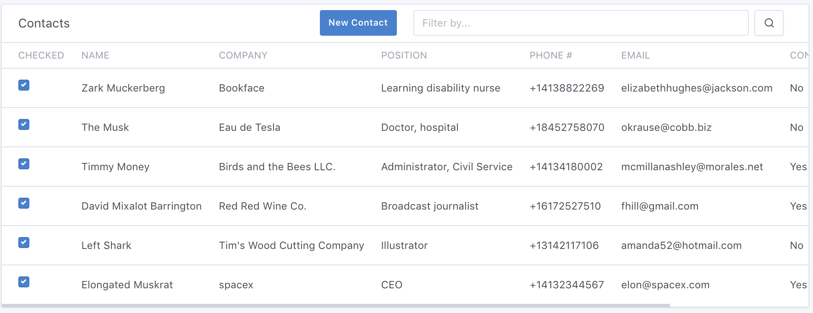

**contact_new.html.j2**

Form for creating new contacts.

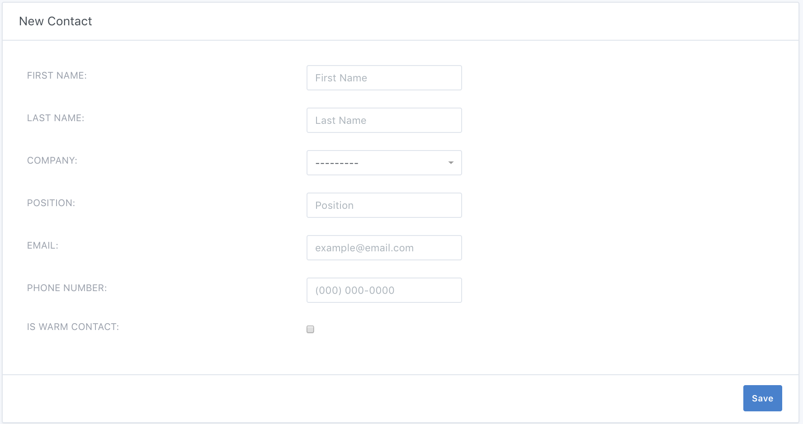

**contact_edit.html.j2**

Form for editing existing contacts.

### Emails

**emails.html.j2**

Page for creating and scheduling a new email.

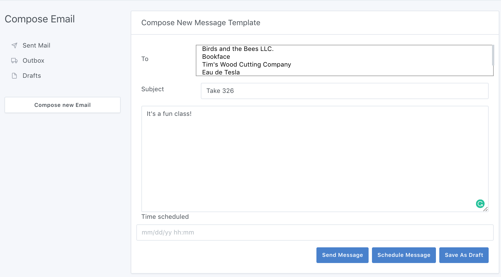

**drafts.html.j2**

Show page for email drafts (unscheduled).

**outbox.html.j2**

Show page for scheduled but unsent emails.

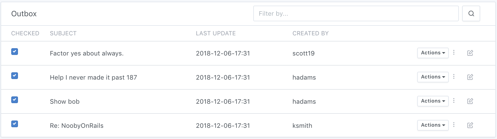

**sent.html.j2**

Show page for emails that have already been sent.

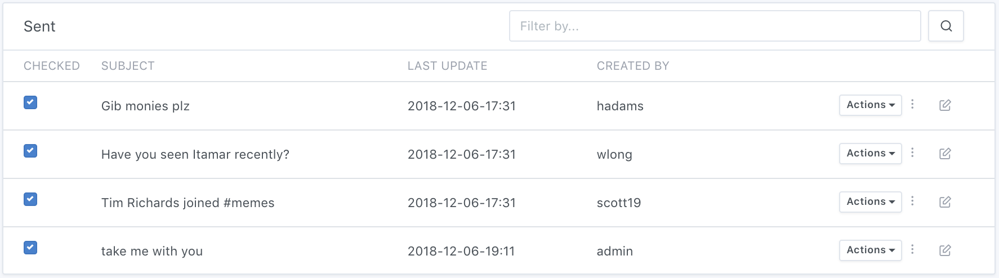

**emails_edit.html.j2**

Edit page for scheduled but unsent emails.

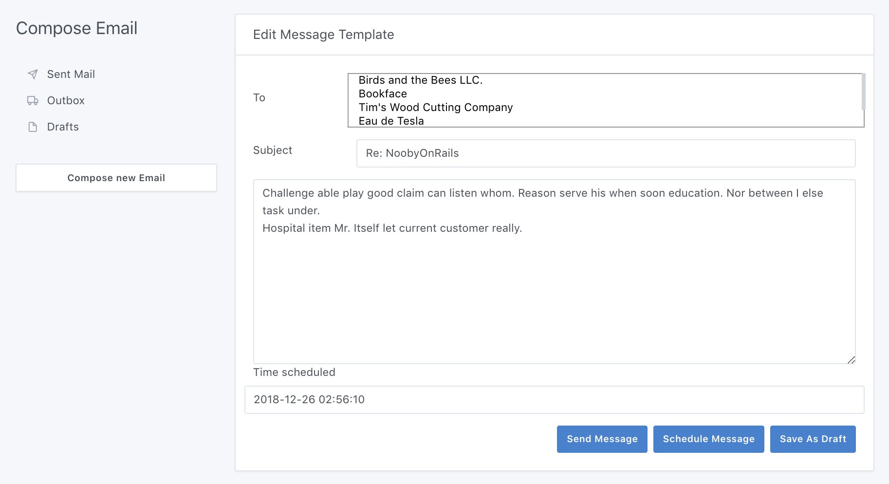

**sent_view.html.j2**

Show page for emails that have already been sent.

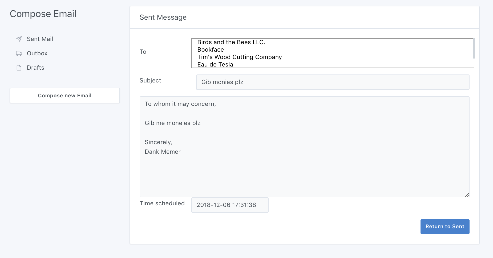

##Data Model

##URL Routes

##Authentication

##Team Choice

##Conclusion
